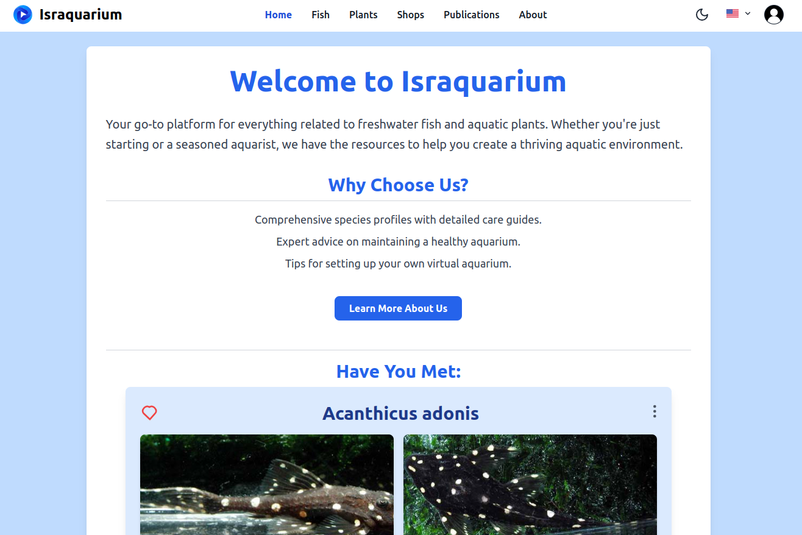

# Israquarium

Welcome to **Israquarium** – your comprehensive resource for freshwater fish and aquatic plants. Whether you're a beginner setting up your first aquarium or a seasoned aquarist looking to expand your knowledge, Israquarium provides the tools and information you need to create and maintain a thriving aquatic environment.

## Table of Contents

- [Introduction](#introduction)
- [Features](#features)
- [Languages Supported](#languages-supported)
- [Screenshots](#screenshots)
- [Installation](#installation)
- [Usage](#usage)
- [Contributing](#contributing)
- [License](#license)
- [Contact](#contact)
- [Additional Information](#additional-information)

## Introduction

Israquarium is an open-source platform designed to offer detailed information on a wide variety of freshwater fish and aquatic plants. Our mission is to empower aquarium enthusiasts with the knowledge and tools necessary to maintain healthy and vibrant aquatic ecosystems. From species profiles and care guides to virtual aquarium management, Israquarium is your go-to destination for all things related to freshwater aquatics.

## Features

- **Comprehensive Species Profiles**: Detailed information on freshwater fish and aquatic plants, including taxonomy, habitat, care requirements, and more.
- **Virtual Aquarium**: Create and manage your own virtual aquarium, tracking your fish and plants, feeding schedules, and maintenance routines.
- **User Management**: Personalized user profiles with options for business accounts and administrative controls.
- **Admin Dashboard**: Manage users, species, plants, shops, and view website statistics with ease.
- **Multilingual Support**: Available in English (US), Russian, and Hebrew to cater to a global audience.
- **Responsive Design**: Accessible on desktops, tablets, and mobile devices for convenience on the go.
- **Community Engagement**: Connect with other aquarium enthusiasts, share tips, and participate in discussions.

## Languages Supported

Israquarium is available in the following languages:

- **English (US)**
- **Russian**
- **Hebrew**

## Screenshots


*Home Page showcasing featured fish and plants.*


*Manage your virtual aquarium with ease.*


*Comprehensive admin dashboard for managing the platform.*

## Installation

### Prerequisites

Before you begin, ensure you have met the following requirements:

- **Node.js** (v18 or higher)
- **MongoDB** (v7 or higher)
- **Git** installed on your machine

### Clone the Repository

```bash
git clone https://github.com/yourusername/israquarium.git
cd israquarium
```


---

### Backend Setup
Navigate to the backend directory and follow the instructions in the [backend README](./server/README.md).
```bash
cd backend
# Follow the backend README instructions
```

### Frontend Setup
Navigate to the frontend directory and follow the instructions in the [frontend README](./client/README.md).
```bash
cd ../frontend
# Follow the frontend README instructions
```

## Usage
Once both the frontend and backend are set up:

1. Start the Backend Server: Ensure your backend server is running by following the backend setup instructions.
2. Start the Frontend Application: Launch the frontend application as per the frontend setup instructions.
3. Explore Features: Navigate through the application to explore fish and plant profiles, manage your virtual aquarium, and utilize other features.

## Contributing
We welcome contributions from the community! To contribute:

1. Fork the Repository: Click the "Fork" button at the top right of this page.
2. Create a Branch: Create a new branch for your feature or bugfix.
3. Commit Your Changes: Make your changes and commit them with clear messages.
4. Open a Pull Request: Submit a pull request detailing your changes.
> Please read our [contribution guidlines](./CONTRIBUTING.md) for more detailed guidelines.


## License
Not yet decided.
You are welcome to everything but the scrapper functionality.


## Contact
If you have any questions, suggestions, or need support, please reach out to us:

- Email: support@israquarium.com
- GitHub Issues: Open an Issue

## Additional Information
For more detailed information about the frontend and backend components of Israquarium, please refer to the respective README files located in the frontend and backend folders of this repository.


Happy Aquarizing! 🐟🌿


